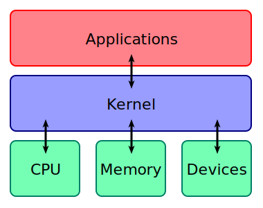
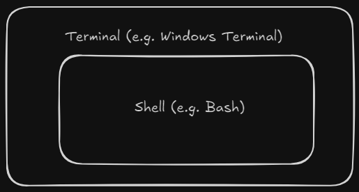
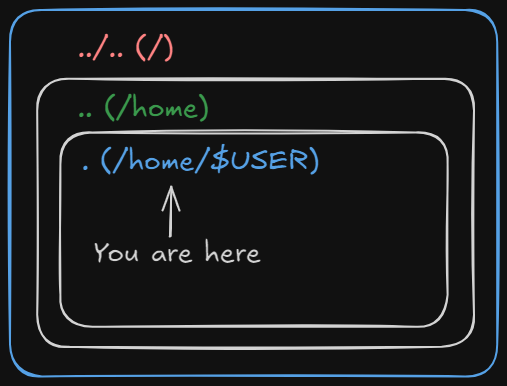
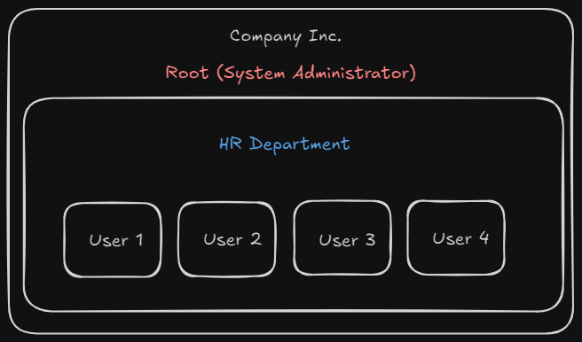
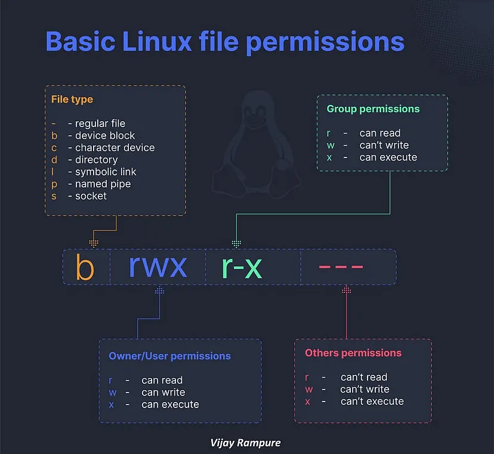
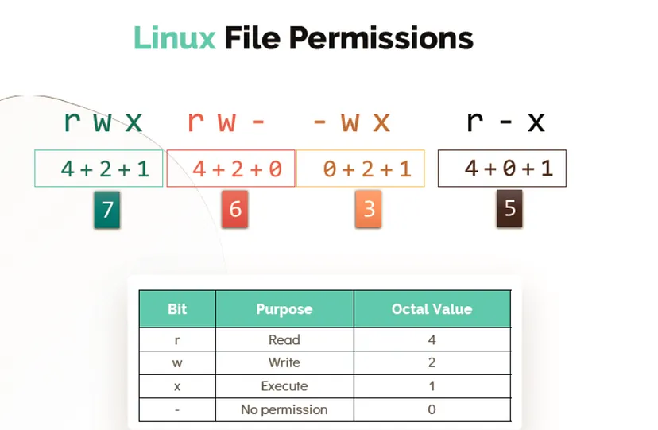

# Intro to Linux Workshop Guide

*Author: Tay Jovan*  
*Last Updated: 2025/09/07*  

## 0. Outline

[1. Introduction & Setup](#1-introduction--setup)  
[2. The Command Line](#2-the-command-line)  
[3. Files & Directories](#3-files--directories)  
[4. Users, Permissions & Ownership](#4-users-permissions--ownership)  
[5. Processes & System Monitoring](#5-processes--system-monitoring)  
[6. Software Management](#6-software-management)  
[7. Redirection, Pipes & Text Processing](#7-redirection-pipes--text-processing)  
[8. Networking & Remote Access](#8-networking--remote-access)  
[9. Next Steps](#9-next-steps)  
[10. References](#10-references)  

## 1. Introduction & Setup

### 1.1. What is Linux?

>Linux is a family of open source Unix-like operating systems based on Linux kernel, an operating system kernel first released on September 17, 1991, by Linux Torvalds ([Wikipedia](https://en.wikipedia.org/wiki/Linux))

Open source is source code that is made freely available for possible modification and redistribution. That means anyone can view it, modify it and create new distributions for it.


> Unix is a family of multitasking, multi-user computer operating systems that derive from the original AT&T Unix ([Wikipedia](https://en.wikipedia.org/wiki/Unix))



> A kernel is a computer program at the core of a computer's operating system that always has complete control over everything in the system. ([Wikipedia](https://en.wikipedia.org/wiki/Kernel_(operating_system)))
### 1.2. Setting Up Linux
#### 1.2.1. Windows Subsystem for Linux (WSL)

>  The Windows Subsystem for Linux (WSL) lets developers install a Linux distribution (such as Ubuntu, OpenSUSE, Kali, Debian, Arch Linux, etc) and use Linux applications, utilities, and Bash command-line tools directly on Windows, unmodified, without the overhead of a traditional virtual machine or dualboot setup. ([Microsoft](https://learn.microsoft.com/en-us/windows/wsl/install))

_Note: If you run into errors regarding WSL features not enabled, run these commands and restart before rerunning the installation command:_

```
dism.exe /online /enable-feature /featurename:Microsoft-Windows-Subsystem-Linux /all /norestart
```

```
dism.exe /online /enable-feature /featurename:VirtualMachinePlatform /all /norestart
```

Installation command:

```
wsl --install
```

System will prompt you to enter your username:

```
Enter new UNIX username: jovan
```

It will then prompt you to create a new password:

(Note: the password field will remain empty while you type, however it is recording your input)

```
New password: password
```

Retype your password you just set:

```
Retype new password: password
```

Once successfully installed, you should see a message similar to this:

```
Installation successful!
To run a command as administrator (user "root"), use "sudo <command>".
See "man sudo_root" for details.

Welcome to Ubuntu 24.04.5 LTS (GNU/Linux 5.15.153.1-microsoft-standard-WSL2 x86_64)

 * Documentation:  https://help.ubuntu.com
 * Management:     https://landscape.canonical.com
 * Support:        https://ubuntu.com/pro

 System information as of Tue Sep  2 21:33:38 +08 2025

  System load:  0.64                Processes:             63
  Usage of /:   0.1% of 1006.85GB   Users logged in:       0
  Memory usage: 3%                  IPv4 address for eth0: <REDACTED>
  Swap usage:   0%


This message is shown once a day. To disable it please create the
/home/jovan/.hushlogin file.
```

## 2. The Command Line

### 2.1. Terminal vs Shell

A terminal is the software application that provides a text-based interface to interact with the shell e.g. `Windows Terminal`

The shell is the program that interprets and executes commands typed by the user. On Ubuntu, we are using [Bash](https://www.gnu.org/software/bash/) (Bourne Again Shell) and on Mac OS, it is [ZSH](https://zsh.sourceforge.io/) (Z Shell).



### 2.2. Basic Commands

First, let's figure out what is the default directory that we are put into when we first start up Linux:

```
pwd
```

To list the current directory contents:

```
ls
```

We get nothing back in the output because the default files in your home directory is hidden. To view hidden files:

```
ls -a
```

To view the files in list form, we add the `-l` switch:

```
ls -la
```

To change our directory we use:

```
cd
```

If we don't specify a directory, by default the system will return us to our home directory (`/home/$USER`).



To change to the parent directory:

```
cd ..
```

To verify that we have moved to the `/home` directory:

```
pwd
```

```
jovan@jovan-laptop:/home$ pwd
/home
```

To move back to our home directory:

```
cd
```

If you need more information about a command, instead of searching the internet, we can instead use a command to view the manual:

```
man
```

Let's view the manual for `man`:

```
man man
```

We can also use the `-h` / `--help` switch to quickly view the options available for a command:

```
man -h
```

or

```
man --help
```

## 3. Files & Directories
### 3.1. Creating and Managing Files & Directories

On Linux, we use the term `directory` instead of `folders`. Unix-like systems represent most resources as files. This means that we can interact with them in a unified way (e.g. `cat`, `ls`, `chmod`).

Some examples:
- `/dev/`: devices
- `/proc/`: processes
- `/etc/`: system config files
- `/sys/`: kernel and device settings

Let's create a directory:

```
mkdir directory
```

Let's create a file:

```
touch file
```

Copy the file:

```
cp file file2
```


Move the file into the directory:

```
mv file directory
```

Remove the file:

```
rm file2
```

Remove the directory:

```
rmdir directory
```

We get an error because the directory contains `file2`:

```
rmdir: failed to remove 'directory': Directory not empty
```

We can change to the directory and manually remove each file inside. But a more efficient method would be to add the `-r` flag to recursively remove all the files within the directory and then the directory itself:

```
rm -r directory
```

Note: a safe practice would be to add `-i` switch to receive a prompt before remove each file:

```
rm -ri directory
```

**WARNING: DO NOT EVER RUN `rm -rf` ON YOUR ROOT DIRECTORY `/`:**

```
# rm -rf /
```

### 3.2. Viewing the file content

Let's download a file to demonstrate the next few commands:

```
curl -o moby-dick.txt https://www.gutenberg.org/files/2701/2701-0.txt
```

To display a file's content, we use `cat` to concatenate it:

```
cat moby-dick.txt
```

Sometimes the file has too much content to be viewed easily in the command line. We can utilise `head` and `tail` to view the first few and last few lines respectively:

```
head moby-dick.txt
```

```
tail moby-dick.txt
```

If we want to view `x` number of lines, we use the `-n` switch to specify:

```
head -n 5 moby-dick.txt
```

```
tail -n 5 moby-dick.txt
```

We can also use the file-pager `less`. This allows you to view the contents of a file one sreen at a time:

```
less moby-dick.txt
```

Common controls:
- `space`: Scroll forward one page
- `b`: Scroll backward one page
- `up/down`: Scroll up/down one line
- `g`: Go to beginning of file
- `G`: Go to end of file
- `/word`: Search forward for "word"
- `n`: Next search result
- `shift + n`: Previous search result
- `q`: Quit

### 3.3. File/Directory Properties

To view a file/directory properties with have to list our current directory in the list format with the `-l` switch:

```
ls -l
```

We should be able to view the properties of the `moby-dick.txt` file we downloaded earlier:

```
-rw-r--r-- 1 jovan jovan 1256529 Jan 19  2025 moby-dick.txt
```

Let's breakdown the output:
1. `-rw-r--r--`: permissions
2. `1`: number of hard links
3. `jovan`: owner
4. `jovan`: group
5. `1256529`: size of the file (in bytes)
6. `Jan 19  2025`: last modified date
7. `moby-dick.txt`: file name
## 4. Users, Permissions & Ownership

### 4.1. Users, Groups & Root



We will use a company to breakdown Users, Groups and the Root user.

In a company, users represents a regular employee. They each have their individual accounts on the system. Each user has a username (e.g. `jovan`), a home directory (e.g. `/home/jovan`) and user ID.

A group represent a department, which the employees belong to.

The root user represents the system administrator. Root can:
- Read, write, or delete _any_ file.
- Install or remove software.
- Manage users and groups.
- Control system processes and settings.


To see which user you are currently logged in as:

```
whoami
```

To view your user information:

```
id
```

To view root information:

```
id root
```

For a normal user to run commands as root temporarily, we will use `sudo` (*superuser do*):

```
sudo
```

Let's create a new user for Alice:

```
sudo adduser alice
```

The system will prompt you to enter the information for `alice`. We are going to leave everything except her password empty.

```
Adding user `alice' ...
Adding new group `alice' (1001) ...
Adding new user `alice' (1001) with group `alice' ...
The home directory `/home/alice' already exists.  Not copying from `/etc/skel'.
New password: password
Retype new password: password
passwd: password updated successfully
Changing the user information for alice
Enter the new value, or press ENTER for the default
        Full Name []: <empty>
        Room Number []: <empty>
        Work Phone []: <empty>
        Home Phone []: <empty>
        Other []: <empty>
Is the information correct? [Y/n] y
```

Let's create a new group for our book club:

```
sudo groupadd book-club
```

Add alice to the `book-club`

```
sudo usermod -aG book-club alice
```

we can verify that `alice` is now part of `book-club`:

```
groups
```

### 4.2. File Permissions

We can view file permissions of `mody-dick.txt` using the `ls -l` command we learnt earlier:

```
ls -l moby-dick.txt
```

```
-rw-r--r-- 1 jovan jovan 1256529 Jan 19  2025 moby-dick.txt
```

Let's change the group ownership of the book to `book-club` and user ownership to `alice`:

```
sudo chown :book-club moby-dick.txt
sudo chown alice moby-dick.txt
```

To verify that ownership has been changed:

```
-rw-r--r-- 1 alice book-club 1256529 Jan 19  2025 moby-dick.txt
```

Let's try reading the file now:

```
cat moby-dick.txt
```

```
cat: moby-dick.txt: Permission denied
```





Let's add ourselves to the `book-club` as well:

```
sudo usermod -aG book-club $USER
```

Now we should be able to read the file again:

```
cat moby-dick.txt
```

Note: if the file still can't be read, you might need to logout and login again.

Let's see if we can write to the file (nano/vim):

```
nano moby-dick.txt
```

or

```
vim moby-dick.txt 
```

The text editor informs us that the file is read-only. This is because as seen earlier, the group `book-club` only has read permissions.

```
-rw-r--r-- 1 alice book-club 1256529 Jan 19  2025 moby-dick.txt
```

Let's give book-club members write permission as well:

```
sudo chmod 660 moby-dick.txt
```

or

```
sudo chmod g+w moby-dick.txt
```

Now we can write to the file as well (nano/vim):

```
nano moby-dick.txt
```

or

```
vim moby-dick.txt 
```

## 5. Processes & System Monitoring

### 5.1. View Running Processes

On most operating systems, multiple processes will be running at the same time. On windows, we would use the task manager to view, start and kill processes. On Linux, we can achieve the same using the CLI.

To view running processes we will use `ps` with the `-a` flag:

```
ps -a
```

```
jovan@jovan-laptop:~$ ps -a
    PID TTY          TIME CMD
    393 pts/1    00:00:00 bash
    412 pts/0    00:00:00 ps
```

Let's breakdown the output:
- `PID`: Process ID
- `TTY`: teletypewriter (how old machines physically interact with mainframes back in the day)
- `TIME`: total CPU time process has used since it started
- `CMD`: program being run

### 5.2. Live Monitoring

If we want to monitor processes in real time, we can use `top` or `htop`:

```
top
```

or

```
htop
```

### 5.3. Foreground & Background Jobs

By default commands run in the foreground:

```
sleep 300
```

While the sleep timer is running, you can't write anything in terminal. So instead, we can run the command in the background:

```
sleep 300 &
```

To view background jobs:

```
jobs
```

To bring it to the foreground

```
fg %1
```

To pause the process, we can use the shortcut `ctrl + z`.

Then send it to the background:

```
bg %1
```

### 5.4. Killing Processes

Let's kill the sleep process, we need to find its `PID`:

```
ps -a | grep sleep
```

```
jovan@jovan-laptop:~$ ps -a | grep sleep
    527 pts/0    00:00:00 sleep
```

Now we can kill the process by specifying its `PID`:

```
kill <PID>
```

Some processes can't be killed normally (system processes). In such situations, we use the `-9` flag to force kill it:

```
kill -9 <PID>
```

## 6. Software Management

### 6.1. Package Managers

In modern distributions like Ubuntu, we can manage applications via the store similar to the Microsoft Store on Windows and App Store on MacOS. However, it is suggested to manage software through package managers.

A package manager is a tool that installs software packages, resolve dependencies and keep track of updates. Some examples include:
- Debian/Ubuntu: `apt`
- Fedora: `dnf`
- Arch Linux: `pacman`
- Windows: `winget`
- MacOS: `homebrew`
### 6..2 Updating, Installing, Removing Software

We really should have started off with this section before proceeding with the rest of the guide. Unlike Windows, your system does not update automatically. Therefore, it is highly recommended to update your packages regularly, especially right after installation. This ensures you always have the latest versions of your packages.

```
sudo apt update
```

This command downloads the latest list of available packages and versions from repositories. A common misconception is that your software is simultaneously upgraded. However, we actually need to run a separate command to do so:

```
sudo apt upgrade
```

We can run both commands simultaneously:

```
sudo apt update && sudo apt upgrade -y
```

Now that our packages are updated, let's install some fun packages:

```
sudo apt install neofetch cowsay -y
```

Try out the following commands yourselves:
	
```
neofetch
```

```
cowsay hi
```

Now we had our fun, let's remove the packages:

```
sudo apt remove neofetch cowsay -y
```

## 7. Redirection, Pipes & Text Processing

### 7.1. Input/Output Redirection

By default:
- Input comes from the keyboard.
- Output goes to the terminal.
- Errors also go to the terminal

We can redirect these streams. We will use our `moby-dick.txt` to demonstrate:

To append a line to the file:

```
echo "hello world" >> moby-dick.txt
```

To count the number of lines in file:

```
wc -l < moby-dick.txt
```

To overwrite the entire file:

```
# we make a copy first
cp moby-dick.txt moby-dick-copy.txt
echo "thanos snap" > moby-dick-copy.txt
```

### 7.2. Piping

As implied by the name, we connect the output of one command to the input of another:

```
cat moby-dick.txt | wc -l
```

### 7.3. Useful Text Processing Tools

To search text by a pattern, we can use `grep`:

```
grep whale moby-dick.txt
```

To count lines, words, characters, we can use `wc`

To count words:

```
wc -w moby-dick.txt
```

To count lines:

```
wc -l moby-dick.txt
```

To count characters:

```
wc -c moby-dick.txt
```

To sort lines sort lines alphabetically or numerically:

```
sort moby-dick.txt
```

To remove the duplicate lines:

```
uniq moby-dick.txt
```

Now that didn't actually do anything since we expect a book not to have duplicate lines, so let's try combine the tools to find the most common IP addresses in a logfile:

We will demonstrate using a example log file from elastic:

```
curl -o access.log https://raw.githubusercontent.com/elastic/examples/master/Common%20Data%20Formats/apache_logs/apache_logs
```

```
awk '{print $1}' access.log | sort | uniq -c | sort -nr | head
```

The command might look intimidating, so let's break it down:
- `awk`: text processing tool that breaks text up into fields
- `sort`: groups identical IPs together (`uniq` only removes **consecutive** duplicate)
- `uniq -c`: removes duplicates and appends the count occurences
- `sort -nr`: sort by count numerically and descending
- `head`: shows the top 10

## 8. Networking & Remote Access

Once in awhile, you may need to check and troubleshoot your internet connection. Linux has built-in tools to help you perform these checks.

To check your current IP address:

```
ip a
```

```
jovan@jovan-laptop:~$ ip addr
...
2: eth0: <BROADCAST,MULTICAST,UP,LOWER_UP> mtu 1280 qdisc mq state UP group default qlen 1000
    link/ether 00:15:5d:76:71:20 brd ff:ff:ff:ff:ff:ff
    inet 172.19.156.32/20 brd 172.19.159.255 scope global eth0
       valid_lft forever preferred_lft forever
    inet6 fe80::215:5dff:fe76:7120/64 scope link
       valid_lft forever preferred_lft forever
```

- `inet`: IPv4 address
- `inet6`: IPv6 address
- `state UP`: interface is active

If you suspect that you are disconnected from the internet, you can test connectivity with `ping`:

```
ping google.com
```

Note: on school internet, request may be blocked to prevent malicious activity

To make a web request, we can use `curl`:

```
curl example.com
```

To save the content into a file (basically downloading the file):

```
curl -o example.html example.com
```

If you have a personal server, you can establish a secure connection to it via `ssh`:

```
ssh <username>@<server-ip>
```

Then to exit the server session:

```
exit
```
## 9. Next Steps

### 9.1. Recap

We gone through a lot of content in this guide so let's do a quick recap:
- [2. The Command Line](#2-the-command-line): `pwd`, `ls`, `cd`, `man`
- [3. Files & Directories](#3-files--directories): `touch`, `cp`, `rm`, `mkdir`, `rmdir`
- [4. Users, Permissions & Ownership](#4-users-permissions--ownership): `whoami`, `id`, `sudo`, `chown`, `chmod`
- [5. Processes & System Monitoring](#5-processes--system-monitoring): `ps`, `top`, `htop`, `kill`, `fg`, `bg`
- [6. Software Management](#6-software-management): `apt`
- [7. Redirection, Pipes & Text Processing](#7-redirection-pipes--text-processing): `cat`, `less`, `head`, `tail`, `grep`, `awk`, `sort`, `uniq`, `wc`
- [8. Networking & Remote Access](#8-networking--remote-access): `ip`, `ping`, `curl`, `ssh`

### 9.2. Best Practices

Use the `man` pages. People often use the phrase RTFM ("Read The Friendly Manual") when a common beginner question is asked. Every command has a built-in manual, and often includes interesting information that you wouldn't find otherwise.

However, using `man` every time you get stuck can get time-consuming and inefficient.  In such cases, you can search online:
- ChatGPT
- StackOverflow
- Forums
- Reddit

But don't accept information wholesale, reference multiple sources and test the commands first. 

Case in point:

```
echo "bye bye system"
# rm -rf /
```

Break down problems into small commands before piping them together. Verify at each step to make sure you know what the commands are actually performing, don't copy and paste scripts and expect everything to be fine.

### 9.3. Recommended Resources

- **Linux Journey** – beginner-friendly interactive tutorials (linuxjourney.com)
- **The Linux Documentation Project (tldp.org)** – in-depth guides and HOWTOs ([tldp.org](https://tldp.org?utm_source=chatgpt.com))
- **Distribution-specific docs** – e.g., [Ubuntu Docs](https://help.ubuntu.com?utm_source=chatgpt.com), Arch Wiki
- OverTheWire Wargames → hands-on Linux and security exercises

## 10. References

- [ChatGPT](chatgpt.com)
- https://en.wikipedia.org/wiki/Linux
- https://en.wikipedia.org/wiki/List_of_Linux_distributions#/media/File:Linux_Distribution_Timeline.svg
- https://en.wikipedia.org/wiki/Unix
- https://en.wikipedia.org/wiki/Kernel_(operating_system)#/media/File:Kernel_Layout.svg
- https://en.wikipedia.org/wiki/Kernel_(operating_system)
- https://www.gnu.org/software/bash/
- https://zsh.sourceforge.io/
- https://wallpapers.com/wallpapers/marvel-villain-thanos-qw0tzjg9vqkn0ju7.html
- https://linuxhandbook.com/linux-file-permissions/
- https://medium.com/@kuldeepkumawat195/how-to-set-file-permissions-in-linux-128894df3eef
- https://medium.com/@tejasmane485/linux-file-permissions-easy-explained-21daae678211
- https://www.gutenberg.org/ebooks/2701
- https://github.com/elastic/examples
